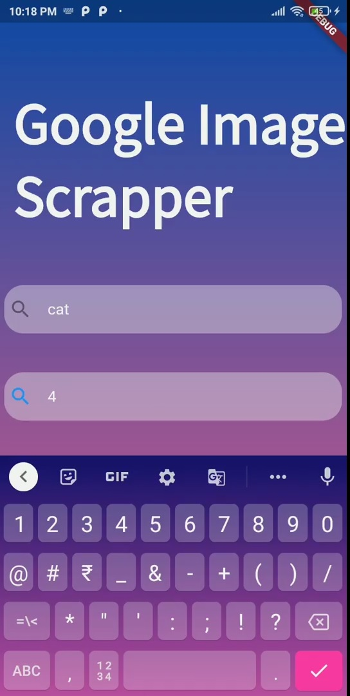
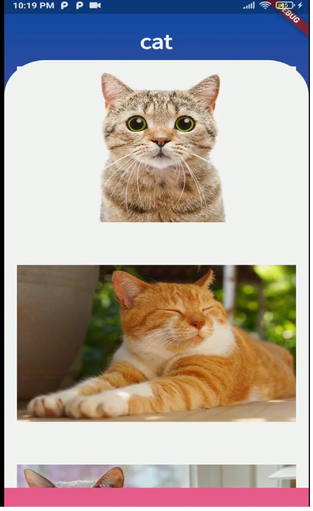

# Google Image Scrapper In Flutter as UI.
---

## Description 

An image scrapper using Selenium is already build in my repository:- https://github.com/luv8860/Google-Image-Scrapper-with-Selenium  and this is the UI for that. This Project explains how to connect each other .
---

## Screens

